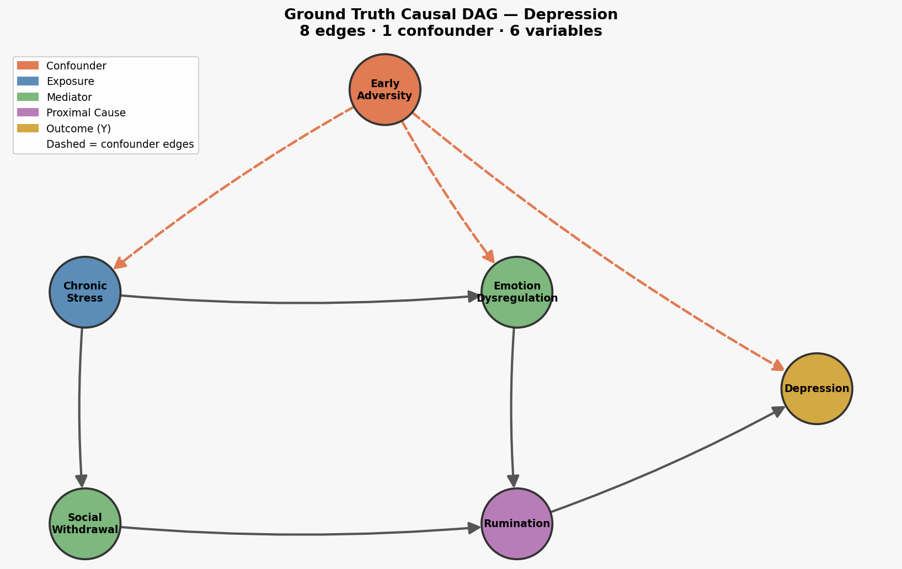

# Ground Truth Causal DAG — Depression



## Overview

This DAG encodes the ground truth causal structure used for simulation studies in the Causal Stories project. It has **6 variables**, **8 directed edges**, and **1 confounder**. The outcome of interest is `depression`.

The structure is grounded in three bodies of empirical literature:
- **ACE studies** (Felitti et al., 1998) on the downstream effects of childhood adversity
- **Nolen-Hoeksema's Response Styles Theory** on rumination as the cognitive engine of depression
- **The diathesis-stress model** linking vulnerability × stressors to depression onset

---

## Variables

### Early Adversity *(Confounder)*
Captures childhood experiences of trauma, neglect, abuse, household dysfunction, or chronic deprivation — the construct operationalised by the Adverse Childhood Experiences (ACE) scale. This variable plays the role of **confounder**: it causally influences both the main exposure (`chronic_stress`) and the outcome (`depression`) through independent pathways. This means that any observed association between chronic stress and depression is partly spurious — driven by the hidden common cause of early adversity — making naive estimation biased.

### Chronic Stress *(Exposure)*
Sustained, uncontrollable stressors in adult life: job loss, financial strain, relationship breakdown, caregiving burden, housing insecurity. This is the primary exposure of interest. In the diathesis-stress model, chronic stress activates pre-existing vulnerabilities (here, early adversity and emotion dysregulation) to produce psychopathology.

### Emotion Dysregulation *(Mediator)*
The difficulty in modifying the intensity, duration, or type of an emotional response when needed. People with poor emotion regulation struggle to down-regulate distress, leading to emotional states that persist and amplify. It is caused both by early adversity (impaired development of regulatory capacity in childhood) and by chronic stress (which depletes the cognitive and affective resources needed for regulation). It then feeds directly into rumination.

### Social Withdrawal *(Mediator)*
The progressive disengagement from social contact and support networks. Under chronic stress, individuals often withdraw as a coping response — avoiding the perceived burden of social interaction. Social support is one of the strongest known buffers against depression; its removal through withdrawal eliminates this protection and creates the conditions for ruminative thought.

### Rumination *(Proximal Cause)*
Repetitive, passive focus on distressing feelings and their possible causes and consequences, without movement toward active problem-solving. Nolen-Hoeksema's research established rumination as the central cognitive mechanism linking stress and negative affect to clinical depression: it prolongs, amplifies, and generalises negative mood. It receives input from both emotion dysregulation (being unable to stop the loop) and social withdrawal (being alone with one's thoughts, with no external distraction or reframing).

### Depression *(Outcome Y)*
The clinical outcome — a sustained state of low mood, anhedonia, fatigue, cognitive slowing, and functional impairment. In this DAG, depression has two direct causes: `rumination` (the long proximal path) and `early_adversity` (a direct biological/psychological pathway via epigenetic changes, disrupted attachment, and HPA-axis dysregulation). All other variables are indirect ancestors.

---

## Edges

| Edge | Mechanism | Literature |
|---|---|---|
| `early_adversity → chronic_stress` | Trauma creates stress-generating life patterns: insecure attachment, risky environments, impaired social skills, hyperactivated threat-detection | Stress generation effect (Hammen, 1991); ACE-to-adult-stressor pathways |
| `early_adversity → emotion_dysregulation` | Childhood adversity impairs the development of prefrontal regulatory circuits and disrupts caregiver-based co-regulation learning | Aldao et al. (2010); developmental neuroscience of ACEs |
| `early_adversity → depression` | Direct pathway via epigenetic changes (HPA axis dysregulation), disrupted attachment schemas, and early onset of negative cognitive styles | Felitti et al. (1998); biological embedding of adversity |
| `chronic_stress → emotion_dysregulation` | Sustained stress depletes cognitive and affective self-regulatory resources (ego depletion; allostatic load) | Baumeister et al.; McEwen's allostatic load model |
| `chronic_stress → social_withdrawal` | Stressed individuals withdraw to reduce perceived demands, avoid burdening others, or conserve energy — removing the main source of social buffering | Cacioppo & Hawkley (2003); stress-induced social avoidance |
| `emotion_dysregulation → rumination` | When negative affect cannot be down-regulated, attention becomes locked onto the distressing state — initiating and sustaining the ruminative cycle | Nolen-Hoeksema et al. (2008); Aldao et al. (2010) |
| `social_withdrawal → rumination` | Social isolation eliminates external distraction and interpersonal reframing, leaving the individual alone with unregulated negative thoughts | Nolen-Hoeksema & Davis (1999); Cacioppo loneliness research |
| `rumination → depression` | The core mechanism in Response Styles Theory: passive dwelling on symptoms prolongs and worsens depressed mood, impairs problem-solving, and erodes motivation | Nolen-Hoeksema (1991, 2000); Lyubomirsky & Nolen-Hoeksema (1995) |

---

## Causal Paths to Depression

There are three distinct causal paths from the root (`early_adversity`) to `depression`:

1. **Direct confounding path** (1 step):
   `early_adversity → depression`

2. **Cognitive-regulatory path** (3 steps):
   `early_adversity → emotion_dysregulation → rumination → depression`

3. **Stress-social-cognitive path** (4 steps):
   `early_adversity → chronic_stress → social_withdrawal → rumination → depression`

And two paths originating from `chronic_stress`:

4. `chronic_stress → emotion_dysregulation → rumination → depression`
5. `chronic_stress → social_withdrawal → rumination → depression`

`Rumination` is the **convergence point**: every indirect path passes through it before reaching `depression`.

---

## Why the Confounder Matters

If we estimate the effect of `chronic_stress → depression` without adjusting for `early_adversity`, the estimate is biased by the backdoor path:

```
chronic_stress ← early_adversity → depression
```

Part of the observed stress-depression correlation is not causal — it reflects that people with early adversity end up in more stressful situations AND are more susceptible to depression, independently. This is the identification challenge the pipeline must grapple with: does the text provide enough evidence to detect `early_adversity` as a confounder and adjust for it?
